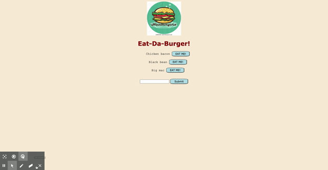

# Hungry for Burgers

## Description
A simple, quirky app that was built to help solidify my understanding of full stack functionality.  Enter the name of a tasty burger you'd like to eat and remove it from your delicious list once it has been devoured!  Check out the deployed version of the app on Heroku [here](https://hungry-for-burgers.herokuapp.com/).

## Technologies
* HTML
* CSS
* JavaScript
* jQuery
* Node v14.15.0
* Express v4.17.1
* Express-Handlebars v5.2.0
* mySQL v2.18.1
* dotenv v8.2.0

## Installation
To install the necessary dependencies to run this application on your local machine:

``` bash
npm --i
```

## Usage
Here's a quick look at what this app can do:  



## License
Copyright &copy; Licensed under the MIT license.

## Questions
Contact me at emilyblair96@gmail.com with questions.